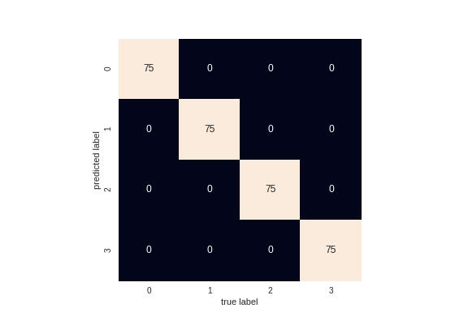

# Homework 2

## Team 19

-Wesley Williams <williamsw16@students.ecu.edu>
-Jared Stanley <standleyja19@students.ecu.edu>

### Quick Start

This is a notebook created from the HW2.py file. Assuming all dependencies are installed, you should be able run each cell in order to see the results.

### Which K works best?

The best K is 4 using the KElbowVisualizer.  The values of K tried ranged from 2 - 20.

### The best K accuracy

The accuracy is usually 100%.  This seems to be because the standard deviation settings are low enough to allow for very well-defined clusters. We did increase the standard deviation setting in the make_blobs function call in a few runs of the program to see the effect on accuracy and the confusion matrix.  We also tried it with more points which also caused a lower accuracy.

### Confusion Matrix

